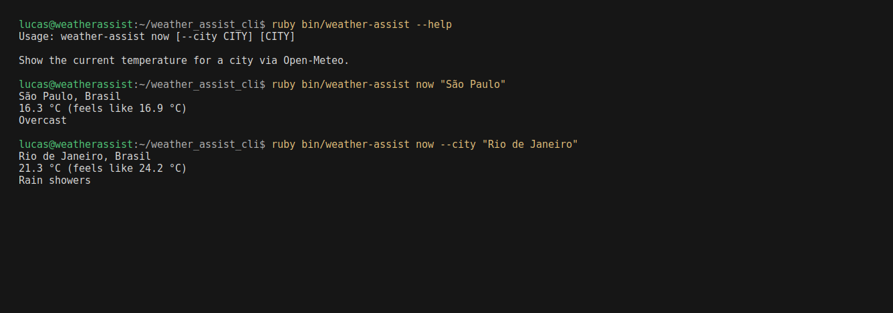

# Weather Assist CLI

> Temperatura atual de uma cidade no terminal, em **Ruby**.  
> [Open-Meteo](https://open-meteo.com/), sem chave de API. Sem cache e sem previsão de vários dias.  
> Skills e subagentes no Cursor e no Kiro.



| | |
|--|--|
| Stack | Ruby 3.2+, stdlib, CLI `weather-assist` |
| Fonte | Open-Meteo (geocoding + forecast atual) |
| Saída | cidade, °C, sensação térmica, condição |
| Fora de escopo | chave de API, cache, previsão de vários dias, gems, interface web |

## Uso

Na raiz deste diretório:

```bash
ruby bin/weather-assist now "São Paulo"
ruby bin/weather-assist now --city "Rio de Janeiro"
```

A saída é em inglês: cidade resolvida, °C, sensação térmica e condição. O print acima é uma sessão real da CLI.

Testes, sem rede:

```bash
ruby -Ilib test/client_test.rb
```

## Cursor

Skills e subagentes ficam neste repositório.

- `/weather-brief` — consulta a temperatura e responde com a saída real da CLI.
- `/weather-cli` — ao mudar o comando `now`, a Open-Meteo ou as unidades.
- Subagente `weather-briefer` — delegue quando a pergunta for só o clima de uma cidade.
- Subagente `weather-verifier` — roda os testes e um `now` ao vivo em São Paulo.

O briefing de sessão está em `AGENTS.md`.

## Kiro

O mesmo `AGENTS.md` entra como steering. O restante fica em `.kiro/`:

- Steering sempre incluído: `.kiro/steering/product.md`, `tech.md`, `structure.md`.
- Skills: `/weather-brief` e `/weather-cli` (também ativam pela descrição).
- Agentes: escolha `weather-briefer` ou `weather-verifier` no seletor da sessão. Eles carregam o steering e as skills pelos `resources`.

Documentação: [steering](https://kiro.dev/docs/steering/), [skills](https://kiro.dev/docs/skills/), [agentes](https://kiro.dev/docs/custom-agents/creating/).
